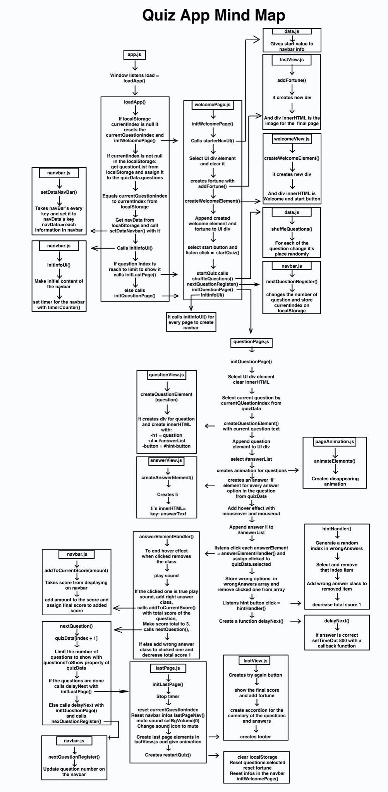

# Quiz Your Future

This is an app as part of a group project by [Ali](https://github.com/cometbroom), [Edward](https://github.com/EdwardAbboud) and [Suleyman](https://github.com/slymny).

## Play the quiz

[here](https://cometbroom.github.io/quiz-your-future/).

## Requirements

- [x] (must have) A user can see one question at a time, stepping through the quiz
- [x] (must have) A user can select an answer for each question
- [x] (must have) Change the \<title>
- [x] (must have) add a favicon
- [x] (should have) A user can see what the correct answer is after they selected their answer.
- [x] (should have) A user can see their score update in real-time as they select answers
- [x] (should have) A user can refresh the page and still have his/her given answers available
- [x] (could have) A user can "skip" the question and learn the correct answer, this forfeits the question
- [x] (could have) Transition between pages or question look fancy like TypeForm for example

## MindMap

